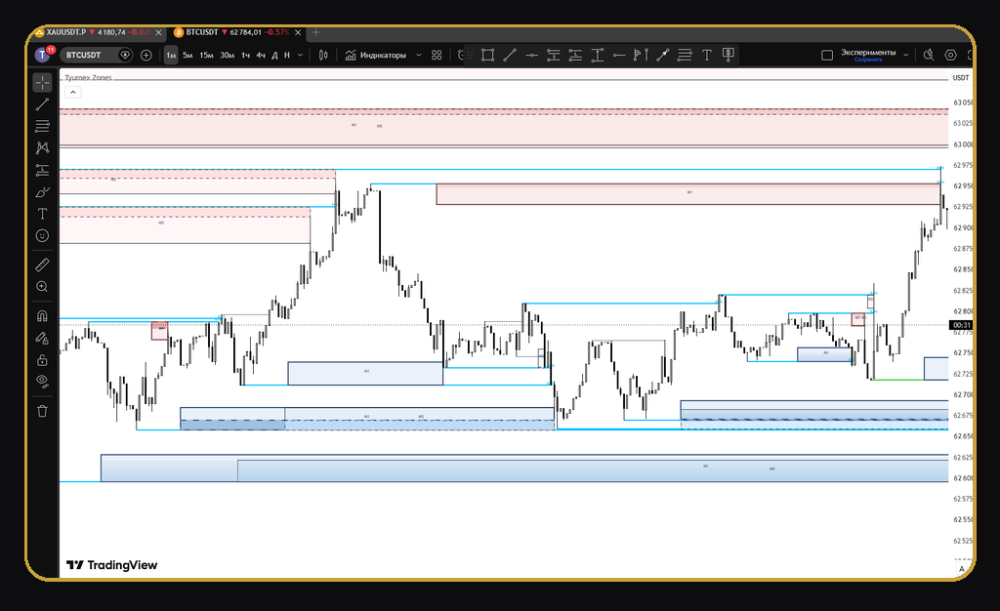
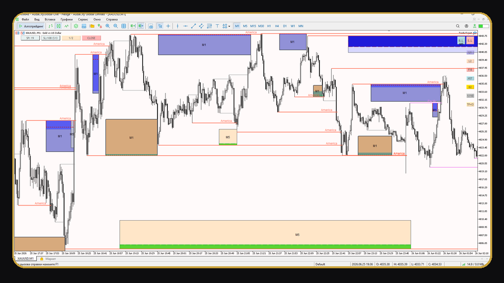
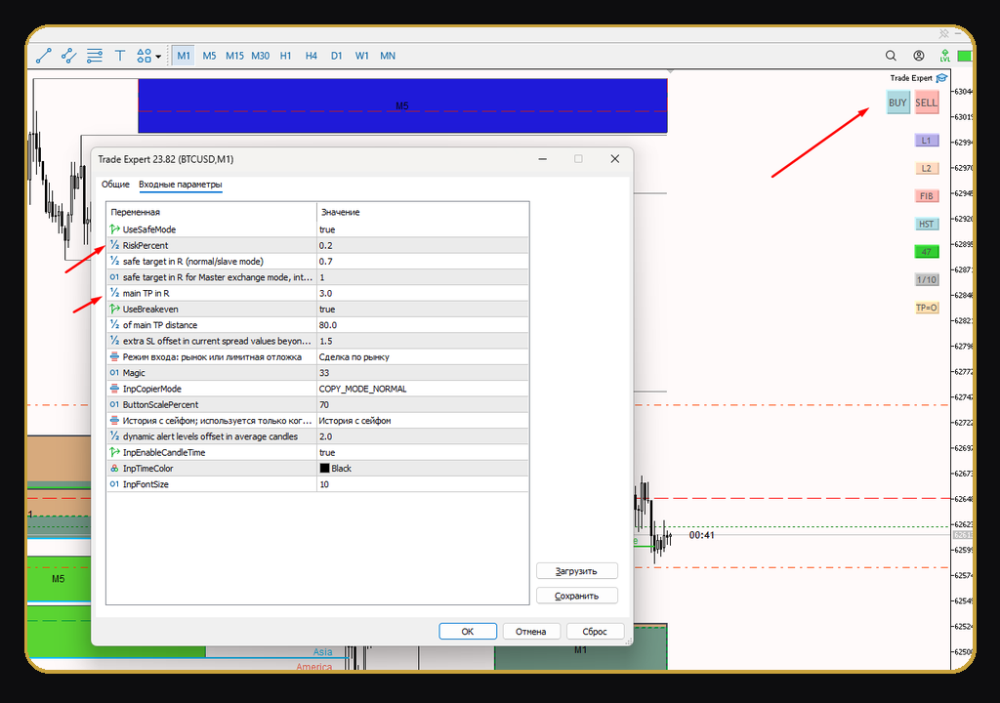
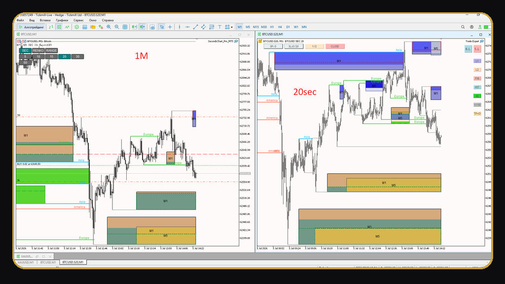

# Tyumex Trading Systems — MT5 Tools (Free 1-Month Trial)

**RU below / Русское описание ниже**

Professional MetaTrader 5 tools: non-repainting reaction zones, one-click trade assistant, and seconds/Renko/Range charts. Compiled `.ex5` trial builds are published in [Releases](../../releases) — free, works until **2026-08-05** (broker time). Full version with account binding: [@Tyumex_bot](https://t.me/Tyumex_bot).

---

## Продукты

### 1. Tyumex Zones — индикатор зон реакции

Зоны, которые видны заранее и **не перерисовываются задним числом**.

- построение в реальном времени;
- работает на валютах, фьючерсах, акциях и крипто;
- лучше всего раскрывается на M1;
- учитывает сессии Asia / Europe / America и ключевые уровни;
- алерты на касание и пробой зоны;
- поддержка Renko / секундных / кастомных графиков.

### 2. Trade Expert — торговый помощник

Помогает держать торговый сценарий в фокусе и спокойнее исполнять сетап.

- вход в один клик с авторасчётом лота от риска;
- стоп под экстремум свечи, тейк в R, частичная фиксация;
- автобезубыток и Safe Mode для дисциплины;
- работа по структуре, а не по эмоциям.

Это помощник к вашей системе, а не «магическая кнопка прибыли».

### 3. Tyumex Second Charts — секундные / Renko / Range графики

Графики, которых нет у брокера: секунды, Renko и Range на одном движке.

- секундные свечи (S5, S10, S20…), Renko и Range;
- переключение режима и размера прямо с панели на графике;
- в разы больше деталей и сетапов внутри минуты;
- строится через кастомные символы MT5 в реальном времени;
- глубина истории задаётся в часах.

---

## Скачать (триал до 05.08.2026)

Скомпилированные `.ex5` — в разделе **[Releases](../../releases)**. Исходный код не публикуется.

Триал-версии работают на **любом счёте MT5** до `2026-08-05 23:59` (время брокера). После этой даты продукт покажет экран продления — новую версию можно получить в [@Tyumex_bot](https://t.me/Tyumex_bot) (7 дней с привязкой к счёту, для партнёров Tickmill — 2 месяца).

## Установка в MetaTrader 5

1. В MT5: **Файл → Открыть каталог данных**.
2. Откройте папку **MQL5**.
3. Скопируйте файлы:
   - `TyumexZones.ex5` → **MQL5\Indicators**
   - `Trade Expert.ex5` → **MQL5\Experts**
   - `TyumexSecondCharts.ex5` → **MQL5\Experts**
4. В «Навигаторе» MT5 нажмите ПКМ → **Обновить** (или перезапустите терминал).
5. Перетащите продукт на график:
   - **TyumexZones** и **Trade Expert** — на график, где торгуете;
   - **TyumexSecondCharts** — на обычный график любого таймфрейма (например M1): он сам откроет отдельный секундный/Renko/Range график, режим и размер переключаются кнопками на панели.

Для Trade Expert и Second Charts включите **Алготрейдинг** (кнопка в панели MT5).

## FAQ

**Почему нет исходного кода?**
Это коммерческий продукт. В репозитории — описание и скомпилированные триал-сборки.

**Что будет после 05.08.2026?**
Инструмент перестанет строить разметку и покажет экран продления. Данные и терминал не затрагиваются.

**Как получить полную версию?**
Напишите в [@Tyumex_bot](https://t.me/Tyumex_bot) — бот выдаёт пробную сборку с привязкой к вашему счёту, менеджер поможет с полным доступом.

---

## English summary

- **Tyumex Zones** — non-repainting reaction zones indicator for MT5 (forex, futures, stocks, crypto; session-aware, alerts, works on Renko/seconds charts).
- **Trade Expert** — trade assistant: one-click entries with risk-based lot sizing, candle-extremum SL, R-based TP, partial close, auto-breakeven, Safe Mode.
- **Tyumex Second Charts** — seconds (S5/S10/S20…), Renko and Range charts for MT5 via real-time custom symbols, with an on-chart control panel.

Trial builds in [Releases](../../releases) work on any MT5 account until **2026-08-05** (broker time). Full access: [@Tyumex_bot](https://t.me/Tyumex_bot).

---

**Contact / Контакты:** Telegram [@Tyumex_bot](https://t.me/Tyumex_bot)

*Trading involves risk. These tools are decision-support instruments, not financial advice and not a guarantee of profit.*
