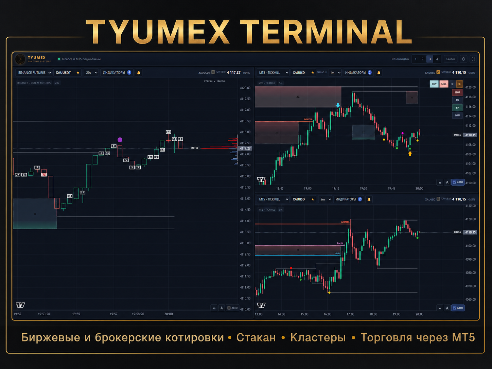
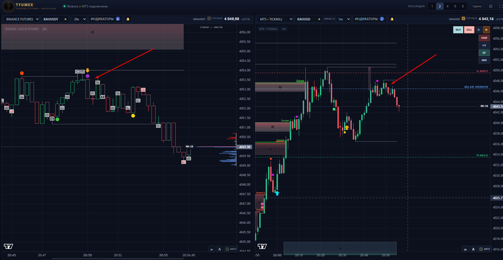

# Tyumex Terminal — Standard Edition

Desktop market terminal for multi-chart analysis and trading with Binance and MetaTrader 5. The Standard Edition is distributed as a ready-to-install Windows package.

TradingView-style alternative for MetaTrader 5 (MT5): a modern multi-chart trading terminal with Binance and MT5 market data, technical indicators, custom short intervals and a professional workspace.

Keywords: TradingView alternative, TradingView-style terminal, MT5 terminal, MetaTrader 5 trading terminal, multi-chart trading terminal, Binance trading terminal.

[Русская версия → README.ru.md](README.ru.md)

## Get 28 days of access

Request the Standard Edition through the official Telegram bot:

**[Open @Tyumex_bot →](https://t.me/Tyumex_bot)**

The bot issues access for 28 days and provides the current installer. The public GitHub repository contains the release package, screenshots, and installation notes.

The installer itself can be opened without a code, but the terminal will not load new market data or allow new trades until a valid personal code is activated. Existing positions can still be closed and protected. The code is issued by [@Tyumex_bot](https://t.me/Tyumex_bot) and is not published in GitHub.

- [Download the latest GitHub Release](https://github.com/Tyumex/tyumex-mt5-tools/releases/latest)
- Current package: TyumexTerminalStandardSetup-1.0.36.exe
- SHA-256: 426D7C51C6F6000B4E51B7EBCC92AAE2280CE6046F4048BC5C957B3F88B6B02D

## What's new in 1.0.36

- Improved recovery and backfill of short Binance USDⓈ-M Futures history, including 20-second intervals.
- More stable zone and signal processing with filtering of weak anchor candles.
- The update keeps the full indicator set, including the Sweep BOS and Wick Reclaim triangle settings.

## What the terminal provides

- Multiple independent chart panes in one workspace, with layouts for focused or multi-market analysis.
- Binance Spot and Binance USD-M Futures market data.
- Local MetaTrader 5 connections, including configurable broker terminals and symbols.
- Native tick aggregation for short periods such as 20s, 30s, and 45s, as well as standard timeframes.
- Candles, live streaming, volume, market depth-style levels, and session-aware chart overlays.
- Built-in SMA, EMA, RSI, MACD, and Bollinger Bands indicators.
- MT5 trade workflow with risk-based or fixed volume, Stop Loss, Take Profit, Safe Mode, break-even, and position closing controls.

The Standard Edition is focused on a clean trading workspace and practical chart tools. It is not financial advice and does not guarantee profit.

## Installation on Windows

1. Download TyumexTerminalStandardSetup-1.0.36.exe from the latest release, or request the current build from [@Tyumex_bot](https://t.me/Tyumex_bot).
# Tyumex Terminal — Standard Edition

Desktop market terminal for multi-chart analysis and trading with Binance and MetaTrader 5. The Standard Edition is distributed as a ready-to-install Windows package.

TradingView-style alternative for MetaTrader 5 (MT5): a modern multi-chart trading terminal with Binance and MT5 market data, technical indicators, custom short intervals and a professional workspace.

Keywords: TradingView alternative, TradingView-style terminal, MT5 terminal, MetaTrader 5 trading terminal, multi-chart trading terminal, Binance trading terminal.

[Русская версия → README.ru.md](README.ru.md)

## Get 28 days of access

Request the Standard Edition through the official Telegram bot:

**[Open @Tyumex_bot →](https://t.me/Tyumex_bot)**

The bot issues access for 28 days and provides the current installer. The public GitHub repository contains the release package, screenshots, and installation notes.

The installer itself can be opened without a code, but the terminal will not load new market data or allow new trades until a valid personal code is activated. Existing positions can still be closed and protected. The code is issued by [@Tyumex_bot](https://t.me/Tyumex_bot) and is not published in GitHub.

- [Download the latest GitHub Release](https://github.com/Tyumex/tyumex-mt5-tools/releases/latest)
- Current package: TyumexTerminalStandardSetup-1.0.36.exe
- SHA-256: 426D7C51C6F6000B4E51B7EBCC92AAE2280CE6046F4048BC5C957B3F88B6B02D

## What's new in 1.0.36

- Improved recovery and backfill of short Binance USDⓈ-M Futures history, including 20-second intervals.
- More stable zone and signal processing with filtering of weak anchor candles.
- The update keeps the full indicator set, including the Sweep BOS and Wick Reclaim triangle settings.

## What the terminal provides

- Multiple independent chart panes in one workspace, with layouts for focused or multi-market analysis.
- Binance Spot and Binance USD-M Futures market data.
- Local MetaTrader 5 connections, including configurable broker terminals and symbols.
- Native tick aggregation for short periods such as 20s, 30s, and 45s, as well as standard timeframes.
- Candles, live streaming, volume, market depth-style levels, and session-aware chart overlays.
- Built-in SMA, EMA, RSI, MACD, and Bollinger Bands indicators.
- MT5 trade workflow with risk-based or fixed volume, Stop Loss, Take Profit, Safe Mode, break-even, and position closing controls.

The Standard Edition is focused on a clean trading workspace and practical chart tools. It is not financial advice and does not guarantee profit.

## Installation on Windows

1. Download TyumexTerminalStandardSetup-1.0.36.exe from the latest release, or request the current build from [@Tyumex_bot](https://t.me/Tyumex_bot).
# Tyumex Terminal — Standard Edition

Desktop market terminal for multi-chart analysis and trading with Binance and MetaTrader 5. The Standard Edition is distributed as a ready-to-install Windows package.

TradingView-style alternative for MetaTrader 5 (MT5): a modern multi-chart trading terminal with Binance and MT5 market data, technical indicators, custom short intervals and a professional workspace.

Keywords: TradingView alternative, TradingView-style terminal, MT5 terminal, MetaTrader 5 trading terminal, multi-chart trading terminal, Binance trading terminal.

[Русская версия → README.ru.md](README.ru.md)

## Get 28 days of access

Request the Standard Edition through the official Telegram bot:

**[Open @Tyumex_bot →](https://t.me/Tyumex_bot)**

The bot issues access for 28 days and provides the current installer. The public GitHub repository contains the release package, screenshots, and installation notes.

The installer itself can be opened without a code, but the terminal will not load new market data or allow new trades until a valid personal code is activated. Existing positions can still be closed and protected. The code is issued by [@Tyumex_bot](https://t.me/Tyumex_bot) and is not published in GitHub.

- [Download the latest GitHub Release](https://github.com/Tyumex/tyumex-mt5-tools/releases/latest)
- Current package: TyumexTerminalStandardSetup-1.0.36.exe
- SHA-256: 426D7C51C6F6000B4E51B7EBCC92AAE2280CE6046F4048BC5C957B3F88B6B02D

## What's new in 1.0.36

- Improved recovery and backfill of short Binance USDⓈ-M Futures history, including 20-second intervals.
- More stable zone and signal processing with filtering of weak anchor candles.
- The update keeps the full indicator set, including the Sweep BOS and Wick Reclaim triangle settings.

## What the terminal provides

- Multiple independent chart panes in one workspace, with layouts for focused or multi-market analysis.
- Binance Spot and Binance USD-M Futures market data.
- Local MetaTrader 5 connections, including configurable broker terminals and symbols.
- Native tick aggregation for short periods such as 20s, 30s, and 45s, as well as standard timeframes.
- Candles, live streaming, volume, market depth-style levels, and session-aware chart overlays.
- Built-in SMA, EMA, RSI, MACD, and Bollinger Bands indicators.
- MT5 trade workflow with risk-based or fixed volume, Stop Loss, Take Profit, Safe Mode, break-even, and position closing controls.

The Standard Edition is focused on a clean trading workspace and practical chart tools. It is not financial advice and does not guarantee profit.

## Installation on Windows

1. Download TyumexTerminalStandardSetup-1.0.36.exe from the latest release, or request the current build from [@Tyumex_bot](https://t.me/Tyumex_bot).
# Tyumex Terminal — Standard Edition

Desktop market terminal for multi-chart analysis and trading with Binance and MetaTrader 5. The Standard Edition is distributed as a ready-to-install Windows package.

TradingView-style alternative for MetaTrader 5 (MT5): a modern multi-chart trading terminal with Binance and MT5 market data, technical indicators, custom short intervals and a professional workspace.

Keywords: TradingView alternative, TradingView-style terminal, MT5 terminal, MetaTrader 5 trading terminal, multi-chart trading terminal, Binance trading terminal.

[Русская версия → README.ru.md](README.ru.md)

## Get 28 days of access

Request the Standard Edition through the official Telegram bot:

**[Open @Tyumex_bot →](https://t.me/Tyumex_bot)**

The bot issues access for 28 days and provides the current installer. The public GitHub repository contains the release package, screenshots, and installation notes.

The installer itself can be opened without a code, but the terminal will not load new market data or allow new trades until a valid personal code is activated. Existing positions can still be closed and protected. The code is issued by [@Tyumex_bot](https://t.me/Tyumex_bot) and is not published in GitHub.

- [Download the latest GitHub Release](https://github.com/Tyumex/tyumex-mt5-tools/releases/latest)
- Current package: TyumexTerminalStandardSetup-1.0.36.exe
- SHA-256: 426D7C51C6F6000B4E51B7EBCC92AAE2280CE6046F4048BC5C957B3F88B6B02D

## What's new in 1.0.36

- Improved recovery and backfill of short Binance USDⓈ-M Futures history, including 20-second intervals.
- More stable zone and signal processing with filtering of weak anchor candles.
- The Standard Edition keeps the same indicator logic and triangle settings as the Author Edition; the difference is limited to the deals section.

## What the terminal provides

- Multiple independent chart panes in one workspace, with layouts for focused or multi-market analysis.
- Binance Spot and Binance USD-M Futures market data.
- Local MetaTrader 5 connections, including configurable broker terminals and symbols.
- Native tick aggregation for short periods such as 20s, 30s, and 45s, as well as standard timeframes.
- Candles, live streaming, volume, market depth-style levels, and session-aware chart overlays.
- Built-in SMA, EMA, RSI, MACD, and Bollinger Bands indicators.
- MT5 trade workflow with risk-based or fixed volume, Stop Loss, Take Profit, Safe Mode, break-even, and position closing controls.

The Standard Edition is focused on a clean trading workspace and practical chart tools. It is not financial advice and does not guarantee profit.

## Installation on Windows

1. Download TyumexTerminalStandardSetup-1.0.36.exe from the latest release, or request the current build from [@Tyumex_bot](https://t.me/Tyumex_bot).
